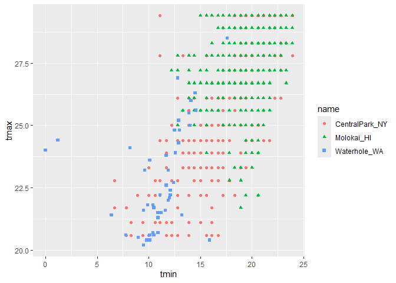
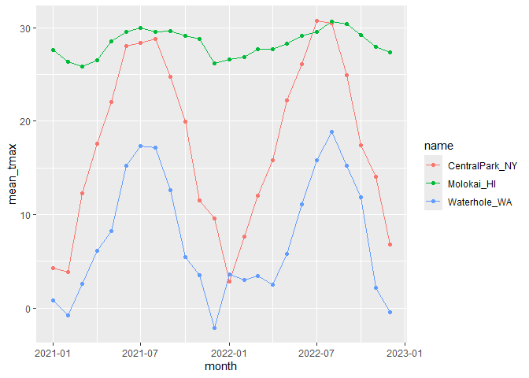
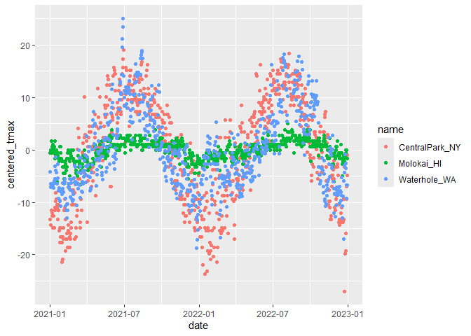

EDA
================

Import weather data

``` r
weather_df = 
  rnoaa::meteo_pull_monitors(
    c("USW00094728", "USW00022534", "USS0023B17S"),
    var = c("PRCP", "TMIN", "TMAX"), 
    date_min = "2021-01-01",
    date_max = "2022-12-31") |>
  mutate(
    name = case_match(
      id, 
      "USW00094728" ~ "CentralPark_NY", 
      "USW00022534" ~ "Molokai_HI",
      "USS0023B17S" ~ "Waterhole_WA"),
    tmin = tmin / 10,
    tmax = tmax / 10,
    month = floor_date(date, unit = "month")) |> 
  select(name, id, everything())
```

    ## using cached file: C:\Users\jyang\AppData\Local/R/cache/R/rnoaa/noaa_ghcnd/USW00094728.dly

    ## date created (size, mb): 2024-09-26 10:24:30.968033 (8.668)

    ## file min/max dates: 1869-01-01 / 2024-09-30

    ## using cached file: C:\Users\jyang\AppData\Local/R/cache/R/rnoaa/noaa_ghcnd/USW00022534.dly

    ## date created (size, mb): 2024-09-26 10:24:51.134281 (3.94)

    ## file min/max dates: 1949-10-01 / 2024-09-30

    ## using cached file: C:\Users\jyang\AppData\Local/R/cache/R/rnoaa/noaa_ghcnd/USS0023B17S.dly

    ## date created (size, mb): 2024-09-26 10:24:58.391098 (1.038)

    ## file min/max dates: 1999-09-01 / 2024-09-30

Let’s make some plots

``` r
weather_df |> 
  ggplot(aes(x = prcp)) +
  geom_histogram()
```

    ## `stat_bin()` using `bins = 30`. Pick better value with `binwidth`.

    ## Warning: Removed 15 rows containing non-finite outside the scale range
    ## (`stat_bin()`).

<!-- -->

``` r
weather_df |> 
  filter(prcp > 1000) #since the initial plot shows outliers, so check if it's a data entry error or real
```

    ## # A tibble: 3 × 7
    ##   name           id          date        prcp  tmax  tmin month     
    ##   <chr>          <chr>       <date>     <dbl> <dbl> <dbl> <date>    
    ## 1 CentralPark_NY USW00094728 2021-08-21  1130  27.8  22.8 2021-08-01
    ## 2 CentralPark_NY USW00094728 2021-09-01  1811  25.6  17.2 2021-09-01
    ## 3 Molokai_HI     USW00022534 2022-12-18  1120  23.3  18.9 2022-12-01

``` r
weather_df |> 
  filter(tmax > 20, tmax <30) |> 
  ggplot(aes(x = tmin, y = tmax, color = name, shape = name)) +
  geom_point()
```

<!-- -->

``` r
#now check the plot to see if there are any outliers
```

## group_by()

``` r
weather_df |> 
  group_by(name, month)
```

    ## # A tibble: 2,190 × 7
    ## # Groups:   name, month [72]
    ##    name           id          date        prcp  tmax  tmin month     
    ##    <chr>          <chr>       <date>     <dbl> <dbl> <dbl> <date>    
    ##  1 CentralPark_NY USW00094728 2021-01-01   157   4.4   0.6 2021-01-01
    ##  2 CentralPark_NY USW00094728 2021-01-02    13  10.6   2.2 2021-01-01
    ##  3 CentralPark_NY USW00094728 2021-01-03    56   3.3   1.1 2021-01-01
    ##  4 CentralPark_NY USW00094728 2021-01-04     5   6.1   1.7 2021-01-01
    ##  5 CentralPark_NY USW00094728 2021-01-05     0   5.6   2.2 2021-01-01
    ##  6 CentralPark_NY USW00094728 2021-01-06     0   5     1.1 2021-01-01
    ##  7 CentralPark_NY USW00094728 2021-01-07     0   5    -1   2021-01-01
    ##  8 CentralPark_NY USW00094728 2021-01-08     0   2.8  -2.7 2021-01-01
    ##  9 CentralPark_NY USW00094728 2021-01-09     0   2.8  -4.3 2021-01-01
    ## 10 CentralPark_NY USW00094728 2021-01-10     0   5    -1.6 2021-01-01
    ## # ℹ 2,180 more rows

counting stuff

``` r
weather_df |> 
  group_by(month) |> 
  summarize(
    n_obs = n(), #n() to count
    n_dist = n_distinct(month))
```

    ## # A tibble: 24 × 3
    ##    month      n_obs n_dist
    ##    <date>     <int>  <int>
    ##  1 2021-01-01    93      1
    ##  2 2021-02-01    84      1
    ##  3 2021-03-01    93      1
    ##  4 2021-04-01    90      1
    ##  5 2021-05-01    93      1
    ##  6 2021-06-01    90      1
    ##  7 2021-07-01    93      1
    ##  8 2021-08-01    93      1
    ##  9 2021-09-01    90      1
    ## 10 2021-10-01    93      1
    ## # ℹ 14 more rows

``` r
weather_df |> 
  group_by(name, month) |> 
  summarize(
    n_obs = n())
```

    ## `summarise()` has grouped output by 'name'. You can override using the
    ## `.groups` argument.

    ## # A tibble: 72 × 3
    ## # Groups:   name [3]
    ##    name           month      n_obs
    ##    <chr>          <date>     <int>
    ##  1 CentralPark_NY 2021-01-01    31
    ##  2 CentralPark_NY 2021-02-01    28
    ##  3 CentralPark_NY 2021-03-01    31
    ##  4 CentralPark_NY 2021-04-01    30
    ##  5 CentralPark_NY 2021-05-01    31
    ##  6 CentralPark_NY 2021-06-01    30
    ##  7 CentralPark_NY 2021-07-01    31
    ##  8 CentralPark_NY 2021-08-01    31
    ##  9 CentralPark_NY 2021-09-01    30
    ## 10 CentralPark_NY 2021-10-01    31
    ## # ℹ 62 more rows

``` r
weather_df |> 
  count(name) #can also use this specifically for counting OR above codes.
```

    ## # A tibble: 3 × 2
    ##   name               n
    ##   <chr>          <int>
    ## 1 CentralPark_NY   730
    ## 2 Molokai_HI       730
    ## 3 Waterhole_WA     730

## 2x2

``` r
weather_df |> 
  drop_na(tmax) |> #because without this code, we are finding NA's under cold
  filter(name != "Molokai_HI") |> 
  mutate(
    cold = case_when(
      tmax < 5 ~ "cold",
      tmax >= 5 ~ "not cold"
    )
  ) |> 
  group_by(name, cold) |> 
  summarize(count = n()) #count is number of obs
```

    ## `summarise()` has grouped output by 'name'. You can override using the
    ## `.groups` argument.

    ## # A tibble: 4 × 3
    ## # Groups:   name [2]
    ##   name           cold     count
    ##   <chr>          <chr>    <int>
    ## 1 CentralPark_NY cold        96
    ## 2 CentralPark_NY not cold   634
    ## 3 Waterhole_WA   cold       319
    ## 4 Waterhole_WA   not cold   395

``` r
weather_df |> 
  drop_na(tmax) |> #because without this code, we are finding NA's under cold
  filter(name != "Molokai_HI") |> 
  mutate(
    cold = case_when(
      tmax < 5 ~ "cold",
      tmax >= 5 ~ "not cold"
    )
  ) |> 
  janitor::tabyl(name, cold) #another way to compute a 2x2 table using janitor package
```

    ##            name cold not cold
    ##  CentralPark_NY   96      634
    ##    Waterhole_WA  319      395

## general numeric summaries.

let’s try some other useful summaries.

``` r
weather_df |> 
  group_by(name, month) |> 
  summarize(
    mean_tmax = mean(tmax, na.rm = TRUE), #na.rm=TRUE to remove missing obs before computing the mean
    median_tmin = median(tmin, na.rm = TRUE),
    sd_prcp = sd(prcp, na.rm = TRUE)
    )
```

    ## `summarise()` has grouped output by 'name'. You can override using the
    ## `.groups` argument.

    ## # A tibble: 72 × 5
    ## # Groups:   name [3]
    ##    name           month      mean_tmax median_tmin sd_prcp
    ##    <chr>          <date>         <dbl>       <dbl>   <dbl>
    ##  1 CentralPark_NY 2021-01-01      4.27       -0.5     47.3
    ##  2 CentralPark_NY 2021-02-01      3.87       -1.85    98.1
    ##  3 CentralPark_NY 2021-03-01     12.3         5       71.3
    ##  4 CentralPark_NY 2021-04-01     17.6         8.05    52.4
    ##  5 CentralPark_NY 2021-05-01     22.1        11.1     74.7
    ##  6 CentralPark_NY 2021-06-01     28.1        18.0     43.3
    ##  7 CentralPark_NY 2021-07-01     28.4        21.1    151. 
    ##  8 CentralPark_NY 2021-08-01     28.8        22.2    236. 
    ##  9 CentralPark_NY 2021-09-01     24.8        17.5    333. 
    ## 10 CentralPark_NY 2021-10-01     19.9        13.9    151. 
    ## # ℹ 62 more rows

summarize and then plot…

``` r
weather_df |> 
  group_by(name, month) |> 
  summarize(
    mean_tmax = mean(tmax, na.rm = TRUE),
    median_tmin = median(tmin, na.rm = TRUE),
    sd_prcp = sd(prcp, na.rm = TRUE)
    ) |> 
  ggplot(aes(x = month, y = mean_tmax, color = name)) +
  geom_point() +
  geom_line()
```

    ## `summarise()` has grouped output by 'name'. You can override using the
    ## `.groups` argument.

<!-- -->

format for readers

``` r
weather_df |> 
  group_by(name, month) |> 
  summarize(
    mean_tmax = mean(tmax, na.rm = TRUE)
    ) |> 
  pivot_wider(
    names_from = name,
    values_from = mean_tmax #making data untidy to be presentable 
  ) |> 
  knitr::kable(
    digits = 3, #digits = changing decimal points
    col.names = c("Month", "Central Park", "Molokai", "Waterhole")) 
```

    ## `summarise()` has grouped output by 'name'. You can override using the
    ## `.groups` argument.

| Month      | Central Park | Molokai | Waterhole |
|:-----------|-------------:|--------:|----------:|
| 2021-01-01 |        4.271 |  27.616 |     0.800 |
| 2021-02-01 |        3.868 |  26.368 |    -0.786 |
| 2021-03-01 |       12.294 |  25.861 |     2.623 |
| 2021-04-01 |       17.607 |  26.567 |     6.097 |
| 2021-05-01 |       22.084 |  28.577 |     8.203 |
| 2021-06-01 |       28.057 |  29.587 |    15.253 |
| 2021-07-01 |       28.352 |  29.994 |    17.335 |
| 2021-08-01 |       28.810 |  29.523 |    17.152 |
| 2021-09-01 |       24.787 |  29.673 |    12.647 |
| 2021-10-01 |       19.926 |  29.129 |     5.481 |
| 2021-11-01 |       11.537 |  28.847 |     3.533 |
| 2021-12-01 |        9.587 |  26.190 |    -2.097 |
| 2022-01-01 |        2.855 |  26.606 |     3.606 |
| 2022-02-01 |        7.650 |  26.829 |     2.989 |
| 2022-03-01 |       11.990 |  27.726 |     3.416 |
| 2022-04-01 |       15.810 |  27.723 |     2.463 |
| 2022-05-01 |       22.255 |  28.283 |     5.810 |
| 2022-06-01 |       26.090 |  29.157 |    11.127 |
| 2022-07-01 |       30.723 |  29.529 |    15.861 |
| 2022-08-01 |       30.500 |  30.697 |    18.830 |
| 2022-09-01 |       24.923 |  30.413 |    15.207 |
| 2022-10-01 |       17.426 |  29.223 |    11.884 |
| 2022-11-01 |       14.017 |  27.960 |     2.140 |
| 2022-12-01 |        6.761 |  27.348 |    -0.460 |

## grouped mutates

``` r
weather_df |> 
  mutate(mean_tmax = mean(tmax, na.rm = TRUE)) #mean tmax computes avg tmax across all tmax obs in the dataset and creating a new column called mean_tmax
```

    ## # A tibble: 2,190 × 8
    ##    name           id          date        prcp  tmax  tmin month      mean_tmax
    ##    <chr>          <chr>       <date>     <dbl> <dbl> <dbl> <date>         <dbl>
    ##  1 CentralPark_NY USW00094728 2021-01-01   157   4.4   0.6 2021-01-01      17.9
    ##  2 CentralPark_NY USW00094728 2021-01-02    13  10.6   2.2 2021-01-01      17.9
    ##  3 CentralPark_NY USW00094728 2021-01-03    56   3.3   1.1 2021-01-01      17.9
    ##  4 CentralPark_NY USW00094728 2021-01-04     5   6.1   1.7 2021-01-01      17.9
    ##  5 CentralPark_NY USW00094728 2021-01-05     0   5.6   2.2 2021-01-01      17.9
    ##  6 CentralPark_NY USW00094728 2021-01-06     0   5     1.1 2021-01-01      17.9
    ##  7 CentralPark_NY USW00094728 2021-01-07     0   5    -1   2021-01-01      17.9
    ##  8 CentralPark_NY USW00094728 2021-01-08     0   2.8  -2.7 2021-01-01      17.9
    ##  9 CentralPark_NY USW00094728 2021-01-09     0   2.8  -4.3 2021-01-01      17.9
    ## 10 CentralPark_NY USW00094728 2021-01-10     0   5    -1.6 2021-01-01      17.9
    ## # ℹ 2,180 more rows

Once you add a grouping layer, tidyverse will remember that grouping.
This can be helpful, but be careful not to forget that you had grouped.
Use group_by exclusively to do an exploratory analysis, and NOT for data
cleaning process(because it will be permanent).

``` r
weather_df |> 
  group_by(name) |> #if you group_by name first, tmax is different
  mutate(mean_tmax = mean(tmax, na.rm = TRUE))
```

    ## # A tibble: 2,190 × 8
    ## # Groups:   name [3]
    ##    name           id          date        prcp  tmax  tmin month      mean_tmax
    ##    <chr>          <chr>       <date>     <dbl> <dbl> <dbl> <date>         <dbl>
    ##  1 CentralPark_NY USW00094728 2021-01-01   157   4.4   0.6 2021-01-01      17.7
    ##  2 CentralPark_NY USW00094728 2021-01-02    13  10.6   2.2 2021-01-01      17.7
    ##  3 CentralPark_NY USW00094728 2021-01-03    56   3.3   1.1 2021-01-01      17.7
    ##  4 CentralPark_NY USW00094728 2021-01-04     5   6.1   1.7 2021-01-01      17.7
    ##  5 CentralPark_NY USW00094728 2021-01-05     0   5.6   2.2 2021-01-01      17.7
    ##  6 CentralPark_NY USW00094728 2021-01-06     0   5     1.1 2021-01-01      17.7
    ##  7 CentralPark_NY USW00094728 2021-01-07     0   5    -1   2021-01-01      17.7
    ##  8 CentralPark_NY USW00094728 2021-01-08     0   2.8  -2.7 2021-01-01      17.7
    ##  9 CentralPark_NY USW00094728 2021-01-09     0   2.8  -4.3 2021-01-01      17.7
    ## 10 CentralPark_NY USW00094728 2021-01-10     0   5    -1.6 2021-01-01      17.7
    ## # ℹ 2,180 more rows

``` r
weather_df |> 
  group_by(name) |> #if you group_by name first, tmax is different
  mutate(
    mean_tmax = mean(tmax, na.rm = TRUE),
    centered_tmax = tmax - mean_tmax)|> 
  ggplot(aes(x = date, y = centered_tmax, color = name)) +
  geom_point()
```

    ## Warning: Removed 17 rows containing missing values or values outside the scale range
    ## (`geom_point()`).

<!-- -->

Find hottest / coldest days using window function

``` r
weather_df |> 
  mutate(
    temp_rank = min_rank(tmax) 
  ) |> 
  filter(temp_rank < 4) #top 4 coldest days
```

    ## # A tibble: 3 × 8
    ##   name         id          date        prcp  tmax  tmin month      temp_rank
    ##   <chr>        <chr>       <date>     <dbl> <dbl> <dbl> <date>         <int>
    ## 1 Waterhole_WA USS0023B17S 2021-12-26   102 -11.4 -18.3 2021-12-01         1
    ## 2 Waterhole_WA USS0023B17S 2021-12-27    25  -9.8 -19.6 2021-12-01         2
    ## 3 Waterhole_WA USS0023B17S 2022-12-21     0  -9.6 -18.4 2022-12-01         3

``` r
weather_df |> 
  group_by(name) |> 
  mutate(
    temp_rank = min_rank(tmax)
  ) |> 
  filter(temp_rank < 4)
```

    ## # A tibble: 9 × 8
    ## # Groups:   name [3]
    ##   name           id          date        prcp  tmax  tmin month      temp_rank
    ##   <chr>          <chr>       <date>     <dbl> <dbl> <dbl> <date>         <int>
    ## 1 CentralPark_NY USW00094728 2022-01-15     0  -6   -12.1 2022-01-01         2
    ## 2 CentralPark_NY USW00094728 2022-01-21     0  -5.5  -9.9 2022-01-01         3
    ## 3 CentralPark_NY USW00094728 2022-12-24     0  -9.3 -13.8 2022-12-01         1
    ## 4 Molokai_HI     USW00022534 2021-01-18   234  22.2  19.4 2021-01-01         2
    ## 5 Molokai_HI     USW00022534 2021-03-18   142  21.7  18.9 2021-03-01         1
    ## 6 Molokai_HI     USW00022534 2022-11-28    56  22.2  20.6 2022-11-01         2
    ## 7 Waterhole_WA   USS0023B17S 2021-12-26   102 -11.4 -18.3 2021-12-01         1
    ## 8 Waterhole_WA   USS0023B17S 2021-12-27    25  -9.8 -19.6 2021-12-01         2
    ## 9 Waterhole_WA   USS0023B17S 2022-12-21     0  -9.6 -18.4 2022-12-01         3

``` r
weather_df |> 
  group_by(name) |> 
  mutate(
    temp_rank = min_rank(desc(tmax)) #if same value, will rank the same
  ) |> 
  filter(temp_rank < 4)
```

    ## # A tibble: 16 × 8
    ## # Groups:   name [3]
    ##    name           id          date        prcp  tmax  tmin month      temp_rank
    ##    <chr>          <chr>       <date>     <dbl> <dbl> <dbl> <date>         <int>
    ##  1 CentralPark_NY USW00094728 2021-06-29     0  35    25.6 2021-06-01         3
    ##  2 CentralPark_NY USW00094728 2021-06-30   165  36.7  22.8 2021-06-01         1
    ##  3 CentralPark_NY USW00094728 2022-07-20     0  35    25.6 2022-07-01         3
    ##  4 CentralPark_NY USW00094728 2022-07-23     0  35    25.6 2022-07-01         3
    ##  5 CentralPark_NY USW00094728 2022-07-24     0  35    26.1 2022-07-01         3
    ##  6 CentralPark_NY USW00094728 2022-08-09     8  36.1  25.6 2022-08-01         2
    ##  7 Molokai_HI     USW00022534 2021-05-31     0  32.2  17.2 2021-05-01         2
    ##  8 Molokai_HI     USW00022534 2021-09-16     0  32.2  21.1 2021-09-01         2
    ##  9 Molokai_HI     USW00022534 2022-07-30     0  32.2  22.2 2022-07-01         2
    ## 10 Molokai_HI     USW00022534 2022-08-06     0  33.3  20.6 2022-08-01         1
    ## 11 Molokai_HI     USW00022534 2022-08-17     0  32.2  21.1 2022-08-01         2
    ## 12 Molokai_HI     USW00022534 2022-09-24     0  32.2  22.2 2022-09-01         2
    ## 13 Molokai_HI     USW00022534 2022-09-30     0  32.2  20   2022-09-01         2
    ## 14 Waterhole_WA   USS0023B17S 2021-06-27     0  28.5  17.6 2021-06-01         3
    ## 15 Waterhole_WA   USS0023B17S 2021-06-28     0  30.8  20.7 2021-06-01         2
    ## 16 Waterhole_WA   USS0023B17S 2021-06-29     0  32.4  17.6 2021-06-01         1

``` r
#can also do below to do the same.

weather_df |> 
  group_by(name) |> 
  filter(min_rank(tmax) < 4) |> 
  arrange(tmax)
```

    ## # A tibble: 9 × 7
    ## # Groups:   name [3]
    ##   name           id          date        prcp  tmax  tmin month     
    ##   <chr>          <chr>       <date>     <dbl> <dbl> <dbl> <date>    
    ## 1 Waterhole_WA   USS0023B17S 2021-12-26   102 -11.4 -18.3 2021-12-01
    ## 2 Waterhole_WA   USS0023B17S 2021-12-27    25  -9.8 -19.6 2021-12-01
    ## 3 Waterhole_WA   USS0023B17S 2022-12-21     0  -9.6 -18.4 2022-12-01
    ## 4 CentralPark_NY USW00094728 2022-12-24     0  -9.3 -13.8 2022-12-01
    ## 5 CentralPark_NY USW00094728 2022-01-15     0  -6   -12.1 2022-01-01
    ## 6 CentralPark_NY USW00094728 2022-01-21     0  -5.5  -9.9 2022-01-01
    ## 7 Molokai_HI     USW00022534 2021-03-18   142  21.7  18.9 2021-03-01
    ## 8 Molokai_HI     USW00022534 2021-01-18   234  22.2  19.4 2021-01-01
    ## 9 Molokai_HI     USW00022534 2022-11-28    56  22.2  20.6 2022-11-01

``` r
weather_df |> 
  group_by(name) |> 
  mutate(
    lagged_tmax = lag(tmax), #lag_tmax gets the temp the day before the tmax day
    temp_change = tmax - lagged_tmax
  ) |> 
  filter(min_rank(temp_change) < 3) 
```

    ## # A tibble: 6 × 9
    ## # Groups:   name [3]
    ##   name     id    date        prcp  tmax  tmin month      lagged_tmax temp_change
    ##   <chr>    <chr> <date>     <dbl> <dbl> <dbl> <date>           <dbl>       <dbl>
    ## 1 Central… USW0… 2022-02-24     0   1.7  -1.6 2022-02-01        20         -18.3
    ## 2 Central… USW0… 2022-12-24     0  -9.3 -13.8 2022-12-01        14.4       -23.7
    ## 3 Molokai… USW0… 2021-01-18   234  22.2  19.4 2021-01-01        27.8        -5.6
    ## 4 Molokai… USW0… 2022-11-28    56  22.2  20.6 2022-11-01        27.2        -5  
    ## 5 Waterho… USS0… 2021-06-30     0  21.5  10.9 2021-06-01        32.4       -10.9
    ## 6 Waterho… USS0… 2022-06-28     0  12.4   5.7 2022-06-01        23.6       -11.2

``` r
#Jan 1 won't have a lagged_temp since its the first day
#BEFORE YOU USE THIS: lag creates a column from the value from the day before, so if your data is not in order, then it will not be smart enough to catch that. 
```

``` r
weather_df |> 
  group_by(name) |> 
  mutate(
    lagged_tmax = lag(tmax), #lag_tmax gets the temp the day before the tmax day
    temp_change = tmax - lagged_tmax
  ) |> 
  summarize(
    sd_tmax_change = sd(temp_change, na.rm = TRUE)
  ) #can see how much day to day variation do you see
```

    ## # A tibble: 3 × 2
    ##   name           sd_tmax_change
    ##   <chr>                   <dbl>
    ## 1 CentralPark_NY           4.43
    ## 2 Molokai_HI               1.24
    ## 3 Waterhole_WA             3.04

## Learning Assessment:

In the PULSE data, the primary outcome is BDI score; it’s observed over
follow-up visits, and we might ask if the typical BDI score values are
roughly similar at each. Try to write a code chunk that imports, cleans,
and summarizes the PULSE data to examine the mean and median at each
visit. Export the results of this in a reader-friendly format.

## PULSE data

``` r
pulse_df = 
  read_sas("data/public_pulse_data.sas7bdat") |> 
  janitor::clean_names() |>
  pivot_longer(
    bdi_score_bl:bdi_score_12m, 
    names_to = "visit",
    values_to = "bdi_score",
    names_prefix = "bdi_score_"
  )

pulse_df |> 
  group_by(visit) |> 
  summarize(
    mean_bdi = mean(bdi_score, na.rm = TRUE),
    median_bdi = median(bdi_score, na.rm = TRUE)
  ) |> 
  knitr::kable(digits = 1)
```

| visit | mean_bdi | median_bdi |
|:------|---------:|-----------:|
| 01m   |      6.0 |          4 |
| 06m   |      5.7 |          4 |
| 12m   |      6.1 |          4 |
| bl    |      8.0 |          6 |

## FAS

``` r
litters_df = 
  read_csv("data/FAS_litters.csv", na = c("NA", ".", "")) |> 
  janitor::clean_names() |> 
  separate(
    group, into = c("dose", "tx_day"), sep = 3
  )
```

    ## Rows: 49 Columns: 8
    ## ── Column specification ────────────────────────────────────────────────────────
    ## Delimiter: ","
    ## chr (2): Group, Litter Number
    ## dbl (6): GD0 weight, GD18 weight, GD of Birth, Pups born alive, Pups dead @ ...
    ## 
    ## ℹ Use `spec()` to retrieve the full column specification for this data.
    ## ℹ Specify the column types or set `show_col_types = FALSE` to quiet this message.

``` r
pups_df = 
  read_csv("data/FAS_pups.csv", na = c("NA", ".", "")) |> 
  janitor::clean_names()
```

    ## Rows: 313 Columns: 6
    ## ── Column specification ────────────────────────────────────────────────────────
    ## Delimiter: ","
    ## chr (1): Litter Number
    ## dbl (5): Sex, PD ears, PD eyes, PD pivot, PD walk
    ## 
    ## ℹ Use `spec()` to retrieve the full column specification for this data.
    ## ℹ Specify the column types or set `show_col_types = FALSE` to quiet this message.

``` r
fas_df = 
  left_join(pups_df, litters_df, by = "litter_number")
```

Compute a table that we care about.

``` r
fas_df |> 
  drop_na(dose) |> #without the drop code, one row has NA in it, but sake of making it easy for the assessment, can just drop.
  group_by(dose, tx_day) |> 
  summarize(mean_pivot = mean(pd_pivot, na.rm = TRUE)) |> 
  pivot_wider(  #make it into a presentable format
    names_from = tx_day,
    values_from = mean_pivot
  ) |> 
  knitr::kable(digits = 2)
```

    ## `summarise()` has grouped output by 'dose'. You can override using the
    ## `.groups` argument.

| dose |    7 |    8 |
|:-----|-----:|-----:|
| Con  | 7.00 | 6.24 |
| Low  | 7.94 | 7.72 |
| Mod  | 6.98 | 7.04 |
