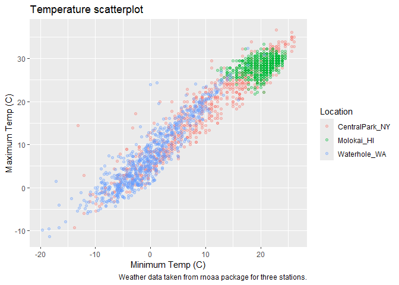
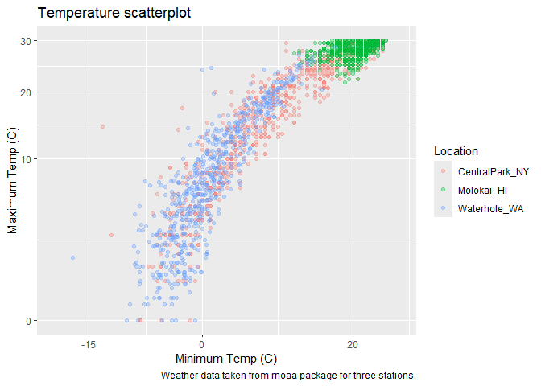
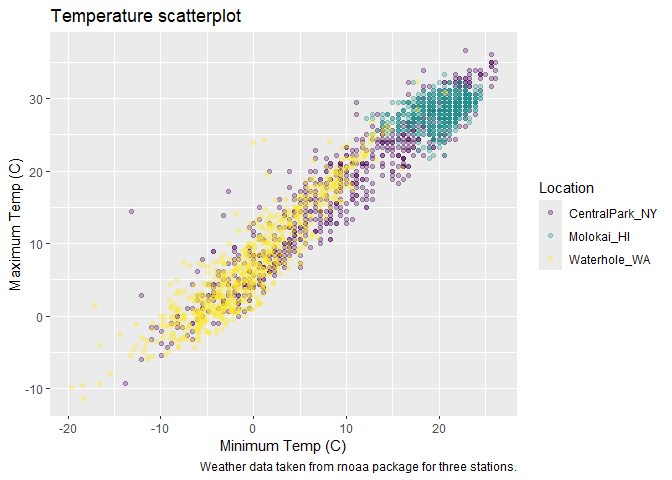
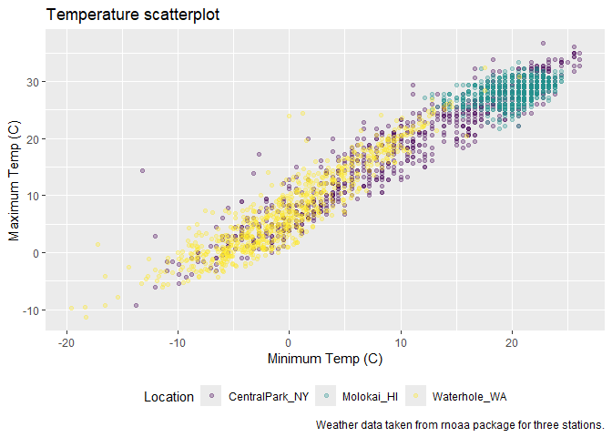
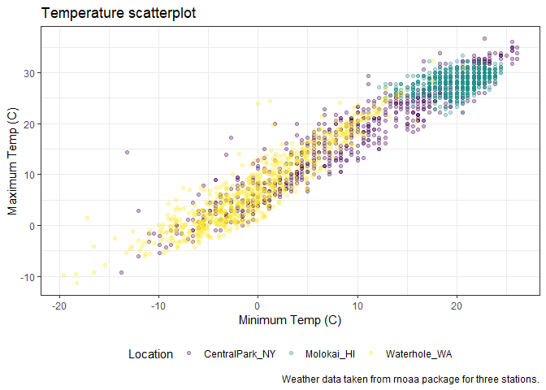
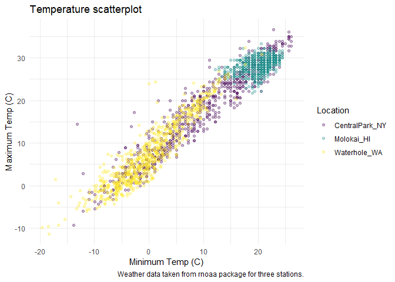
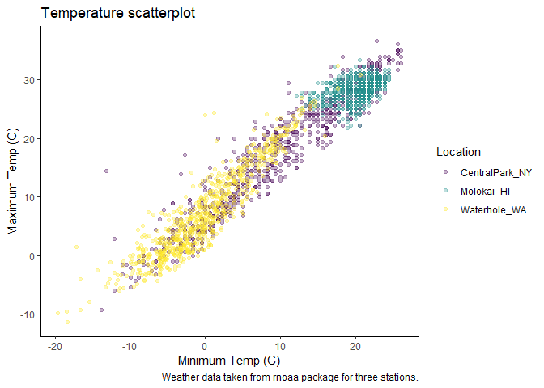
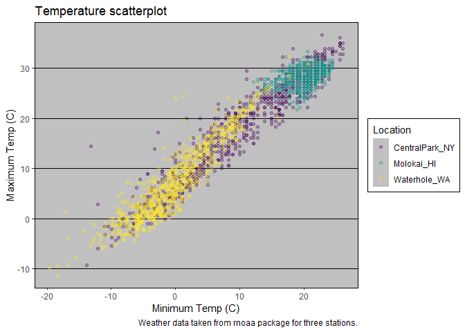

Vis II
================

``` r
weather_df = 
  rnoaa::meteo_pull_monitors(
    c("USW00094728", "USW00022534", "USS0023B17S"),
    var = c("PRCP", "TMIN", "TMAX"), 
    date_min = "2021-01-01",
    date_max = "2022-12-31") |>
  mutate(
    name = case_match(
      id, 
      "USW00094728" ~ "CentralPark_NY", 
      "USW00022534" ~ "Molokai_HI",
      "USS0023B17S" ~ "Waterhole_WA"),
    tmin = tmin / 10,
    tmax = tmax / 10) |>
  select(name, id, everything())
```

    ## using cached file: C:\Users\jyang\AppData\Local/R/cache/R/rnoaa/noaa_ghcnd/USW00094728.dly

    ## date created (size, mb): 2024-09-26 10:24:30.968033 (8.668)

    ## file min/max dates: 1869-01-01 / 2024-09-30

    ## using cached file: C:\Users\jyang\AppData\Local/R/cache/R/rnoaa/noaa_ghcnd/USW00022534.dly

    ## date created (size, mb): 2024-09-26 10:24:51.134281 (3.94)

    ## file min/max dates: 1949-10-01 / 2024-09-30

    ## using cached file: C:\Users\jyang\AppData\Local/R/cache/R/rnoaa/noaa_ghcnd/USS0023B17S.dly

    ## date created (size, mb): 2024-09-26 10:24:58.391098 (1.038)

    ## file min/max dates: 1999-09-01 / 2024-09-30

Make a scatterplot but fancy this time

``` r
weather_df |> 
  ggplot(aes(x = tmin, y = tmax, color = name)) +
  geom_point(alpha = .3) +
  labs(
    title = "Temperature scatterplot",
    x = "Minimum Temp (C)",
    y = "Maximum Temp (C)",
    color = "Location",
    caption = "Weather data taken from rnoaa package for three stations."
  )
```

    ## Warning: Removed 17 rows containing missing values or values outside the scale range
    ## (`geom_point()`).

<!-- -->

Scales – start with `x` and `y` and then do `color`/

``` r
weather_df |> 
  ggplot(aes(x = tmin, y = tmax, color = name)) +
  geom_point(alpha = .3) +
  labs(
    title = "Temperature scatterplot",
    x = "Minimum Temp (C)",
    y = "Maximum Temp (C)",
    color = "Location",
    caption = "Weather data taken from rnoaa package for three stations."
  ) +
  scale_x_continuous(
    breaks = c(-15, 0, 20),
    labels = c("-15", "0", "20")
  ) +
  scale_y_continuous(
    limits = c(0, 30),
    transform = "sqrt"
    )
```

    ## Warning in transformation$transform(x): NaNs produced

    ## Warning in scale_y_continuous(limits = c(0, 30), transform = "sqrt"): sqrt
    ## transformation introduced infinite values.

    ## Warning: Removed 302 rows containing missing values or values outside the scale range
    ## (`geom_point()`).

<!-- -->

Look at color:

``` r
weather_df |> 
  ggplot(aes(x = tmin, y = tmax, color = name)) +
  geom_point(alpha = .3) +
  labs(
    title = "Temperature scatterplot",
    x = "Minimum Temp (C)",
    y = "Maximum Temp (C)",
    color = "Location",
    caption = "Weather data taken from rnoaa package for three stations."
  ) +
  viridis::scale_color_viridis(discrete = TRUE) #making viridis variable discrete not continuous
```

    ## Warning: Removed 17 rows containing missing values or values outside the scale range
    ## (`geom_point()`).

<!-- -->

## Themes

``` r
ggp_scatterplot =
  weather_df |> 
  ggplot(aes(x = tmin, y = tmax, color = name)) +
  geom_point(alpha = .3) +
  labs(
    title = "Temperature scatterplot",
    x = "Minimum Temp (C)",
    y = "Maximum Temp (C)",
    color = "Location",
    caption = "Weather data taken from rnoaa package for three stations."
  ) +
  viridis::scale_color_viridis(discrete = TRUE)
```

``` r
ggp_scatterplot +
  theme(legend.position = "bottom")
```

    ## Warning: Removed 17 rows containing missing values or values outside the scale range
    ## (`geom_point()`).

<!-- -->

``` r
ggp_scatterplot +
  theme_bw() +
  theme(legend.position = "bottom")
```

    ## Warning: Removed 17 rows containing missing values or values outside the scale range
    ## (`geom_point()`).

<!-- -->

Order matters …

``` r
ggp_scatterplot +
  theme(legend.position = "bottom") +
  theme_bw()
```

    ## Warning: Removed 17 rows containing missing values or values outside the scale range
    ## (`geom_point()`).

<!-- -->

``` r
ggp_scatterplot +
  theme(legend.position = "bottom") +
  theme_minimal() #same as theme_bw without the box around outside
```

    ## Warning: Removed 17 rows containing missing values or values outside the scale range
    ## (`geom_point()`).

<!-- -->

``` r
ggp_scatterplot +
  theme(legend.position = "bottom") +
  theme_classic() #this looks to be what I like
```

    ## Warning: Removed 17 rows containing missing values or values outside the scale range
    ## (`geom_point()`).

<!-- -->

``` r
ggp_scatterplot +
  theme(legend.position = "bottom") +
  ggthemes::theme_excel() #does not look good
```

    ## Warning: Removed 17 rows containing missing values or values outside the scale range
    ## (`geom_point()`).

<!-- -->
